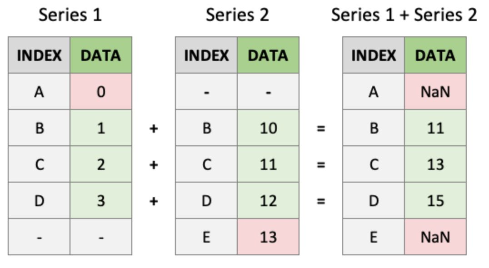
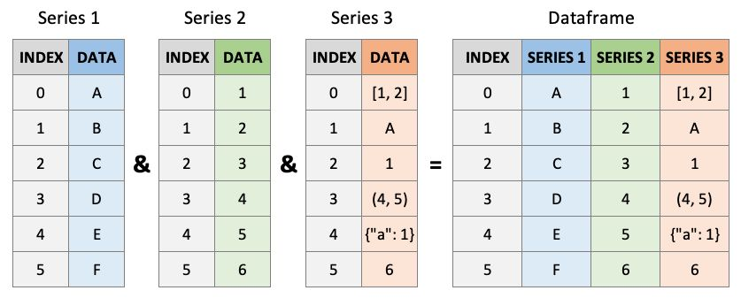

## Today {.smaller}

::: {.kicker}
Week 5, session 1 of 2
:::

1. Quiz — five minutes, on numpy and iteration
2. DataFrames and Series: values with labels
3. Reading and checking a table
4. Selecting rows and columns with `.loc` and `.iloc`
5. Turning date strings into a `DatetimeIndex`
6. Selecting and resampling a time series

Today's question: how do we get from a CSV to a defensible monthly hydrologic
record?

# Labels prevent silent mistakes {background-color="#0C234B"}

## Position alone does not explain itself

```python
data[3, 7]     # which well, and which measurement?
```

::: {.fragment}
Insert a column at position 2 and every later index changes. The code still
runs; the meaning silently moves.
:::

```python
wells.loc["320824110593001", "well_depth_ft"]
```

::: {.fragment}
Labels survive reordering. If a required label disappears, pandas raises a
`KeyError` at the point where the assumption failed.
:::

<!-- Figure recovered from old_slides/hwrs564a_sept18.pdf, p. 10. -->
## Labels decide which values meet

{fig-alt="Two pandas Series align on labels B, C, and D before addition, leaving NaN at unmatched labels A and E" width="82%"}

::: {.fragment}
Pandas matches `B` with `B`, not the second row with the second row. Unmatched
labels remain in the result and become `NaN` instead of silently shifting the
data.
:::

## Two objects cover most of pandas

::: {.columns}
::: {.column width="50%"}
**`Series`**

One labelled sequence.

```python
wells["well_depth_ft"]
```
:::

::: {.column width="50%"}
**`DataFrame`**

Columns that share an index.

```python
wells[["site_no", "well_depth_ft"]]
```
:::
:::

::: {.fragment}
One column name returns a Series. A list of names returns a DataFrame.
:::

<!-- Figure recovered from old_slides/hwrs564a_sept18.pdf, p. 12. -->
## A DataFrame is aligned Series

{fig-alt="Three labelled Series combining into the columns of one DataFrame" width="88%"}

::: {.fragment}
The shared index is what makes the rows cohere. Column names distinguish the
three measurements; row labels identify the observation each value belongs to.
:::

## Read the table, then look before calculating

```python
from pathlib import Path
import pandas as pd

ROOT = next(
    p for p in [Path.cwd(), *Path.cwd().parents]
    if (p / "pyproject.toml").exists()
)
wells = pd.read_csv(
    ROOT / "data" / "tucson_basin_wells.csv",
    dtype={"site_no": str},
)
```

::: {.fragment}
`site_no` is an identifier, not a number. Reading it as text preserves leading
zeros and makes later joins reliable.
:::

## Four checks, every time

```python
print(wells.shape)          # did the expected table arrive?
print(wells.dtypes)         # are identifiers and numbers typed correctly?
print(wells.isna().sum())   # where is information missing?
print(wells.describe())     # are ranges physically plausible?
```

::: {.fragment .due-notice}
These checks take seconds. They are part of the analysis, not decoration before
the analysis begins.
:::

## Your turn: convert and summarise

Add land-surface elevation in metres and find the mean well depth.

```{pyodide}
#| setup: true
#| exercise: ex_columns
import pandas as pd
wells = pd.DataFrame({
    "site_no": ["A", "B", "C", "D"],
    "well_depth_ft": [61.0, 110.0, 835.0, 397.0],
    "land_surface_elev_ft": [2675.0, 2698.0, 2701.0, 2662.0],
})
FEET_TO_M = 0.3048
```

```{pyodide}
#| exercise: ex_columns
wells["land_surface_elev_m"] = ______
mean_depth_ft = ______
print(wells)
print(f"mean depth: {mean_depth_ft:.1f} ft")
```

::: {.hint exercise="ex_columns"}
::: {.callout-note collapse="false"}
## Hint

Assigning to a new column name creates it. Series arithmetic is elementwise.
:::
:::

::: {.solution exercise="ex_columns"}
::: {.callout-tip collapse="false"}
## Solution

```python
wells["land_surface_elev_m"] = wells["land_surface_elev_ft"] * FEET_TO_M
mean_depth_ft = wells["well_depth_ft"].mean()
```

The mean is `350.8 ft`.
:::
:::

# Select by meaning {background-color="#AB0520"}

## `.loc` uses labels; `.iloc` uses positions

::: {.columns}
::: {.column width="50%"}
**`.loc[row, column]`**

```python
wells.loc["C-22", "well_depth_ft"]
```

Use when labels carry meaning.
:::

::: {.column width="50%"}
**`.iloc[row, column]`**

```python
wells.iloc[2, 1]
```

Use when position is genuinely the question.
:::
:::

::: {.fragment}
`.loc` slices include the endpoint. `.iloc` slices follow ordinary Python and
exclude it.
:::

## Your turn: two kinds of selection

Get the third row by position and well `C-22` by name.

```{pyodide}
#| setup: true
#| exercise: ex_select
import pandas as pd
wells = pd.DataFrame({
    "well_depth_ft": [61.0, 110.0, 835.0, 397.0],
}, index=["A-14", "B-07", "C-22", "D-03"])
```

```{pyodide}
#| exercise: ex_select
third_row = wells.______[2]
by_name = wells.______["C-22"]
print(third_row)
print(by_name)
```

::: {.hint exercise="ex_select"}
::: {.callout-note collapse="false"}
## Hint

“Third” is a position. `C-22` is a label.
:::
:::

::: {.solution exercise="ex_select"}
::: {.callout-tip collapse="false"}
## Solution

```python
third_row = wells.iloc[2]
by_name = wells.loc["C-22"]
```

They happen to return the same value before sorting. The accessors still mean
different things.
:::
:::

# Dates unlock time-series operations {background-color="#0C234B"}

## Strings look like dates but behave like text

```python
flow = pd.read_csv("flow.csv")
flow["datetime"].dtype                # object
```

::: {.fragment}
Text dates can sort incorrectly, cannot be subtracted, and do not know their
month or water year.
:::

```python
flow = pd.read_csv("flow.csv", parse_dates=["datetime"])
flow = flow.set_index("datetime").sort_index()
```

::: {.fragment}
A `DatetimeIndex` turns time into a selectable and groupable coordinate.
:::

## Select time using partial date strings

```python
flow.loc["2006"]
flow.loc["2006-08"]
flow.loc["2006-07":"2006-09"]
```

::: {.fragment}
The final slice includes all of July through September. The inclusive `.loc`
rule is useful here.
:::

::: {.fragment}
If dates stay in a column, use `.dt`: `levels["date"].dt.month`.
:::

## Your turn: select the monsoon

Pull July through September 2006 from a daily series.

```{pyodide}
#| setup: true
#| exercise: ex_dates
import pandas as pd
import numpy as np
idx = pd.date_range("2005-01-01", "2007-12-31", freq="D")
q = pd.Series(np.abs(np.sin(np.arange(len(idx)) / 58)) * 40, index=idx)
```

```{pyodide}
#| exercise: ex_dates
monsoon = q.loc[______]
print(monsoon.index.min(), monsoon.index.max(), len(monsoon))
```

::: {.hint exercise="ex_dates"}
::: {.callout-note collapse="false"}
## Hint

Use a slice containing two partial date strings.
:::
:::

::: {.solution exercise="ex_dates"}
::: {.callout-tip collapse="false"}
## Solution

```python
monsoon = q.loc["2006-07":"2006-09"]
```

The slice contains 92 daily values.
:::
:::

# Resampling changes temporal resolution {background-color="#AB0520"}

## One method, different hydrologic questions

```python
flow["discharge_cfs"].resample("ME").mean()
flow["discharge_cfs"].resample("YE").max()
flow["discharge_cfs"].resample("YE-SEP").mean()
```

| Question | Aggregation |
|---|---|
| Average conditions | `.mean()` |
| Accumulated depth or volume | `.sum()` |
| Flood magnitude | `.max()` |
| Typical value resistant to peaks | `.median()` |

::: {.fragment}
The code is easy. Choosing the aggregation is the hydrology.
:::

## The water year ends in September

```python
water_year_flow = flow["discharge_cfs"].resample("YE-SEP").mean()
```

::: {.incremental}
- Water year 2007 runs from 1 October 2006 through 30 September 2007.
- It is named for the year in which it ends.
- A partial first or last year must be identified before comparison.
:::

::: {.fragment .due-notice}
Do not let a three-month stub become the “driest year” in your analysis.
:::

## Your turn: calendar year and water year

```{pyodide}
#| setup: true
#| exercise: ex_resample
import pandas as pd
import numpy as np
idx = pd.date_range("2005-01-01", "2024-12-31", freq="D")
q = pd.Series(np.abs(np.sin(np.arange(len(idx)) / 58)) * 40, index=idx)
```

```{pyodide}
#| exercise: ex_resample
calendar = q.resample(______).mean()
water_year = q.resample(______).mean()
print(len(calendar), len(water_year))
```

::: {.hint exercise="ex_resample"}
::: {.callout-note collapse="false"}
## Hint

Calendar years end in December; western-US water years end in September.
:::
:::

::: {.solution exercise="ex_resample"}
::: {.callout-tip collapse="false"}
## Solution

```python
calendar = q.resample("YE").mean()
water_year = q.resample("YE-SEP").mean()
```

The water-year result has an extra partial bin because the record starts in
January rather than October.
:::
:::

## Wrap up {.smaller}

::: {.kicker}
What you can now do
:::

- Read and inspect a labelled table
- Select by label, position, and time
- Parse dates once instead of repairing them repeatedly
- Resample a daily series to a hydrologically meaningful interval
- Recognise incomplete water-year bins

::: {.kicker}
Before Thursday
:::

- Parts 1–3 of `labs/week05/week05_lab_pandas.ipynb`

::: {.kicker}
Thursday
:::

Filtering, grouping, rolling windows, and reshaping one table for a different
job.
