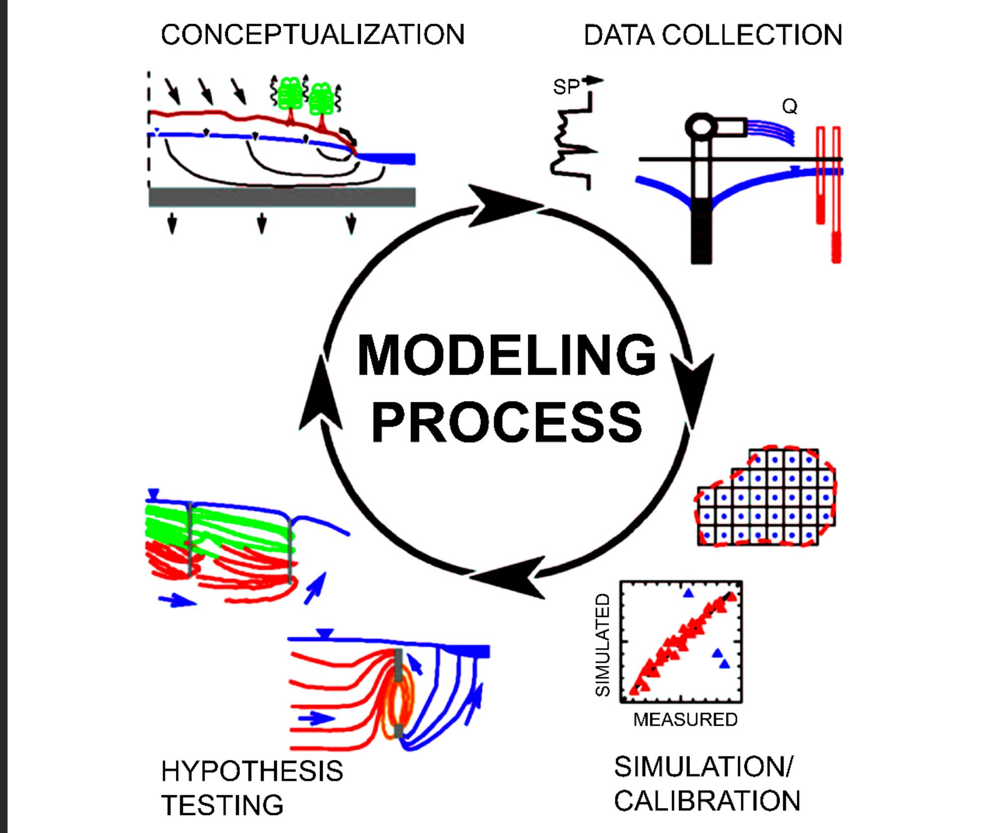
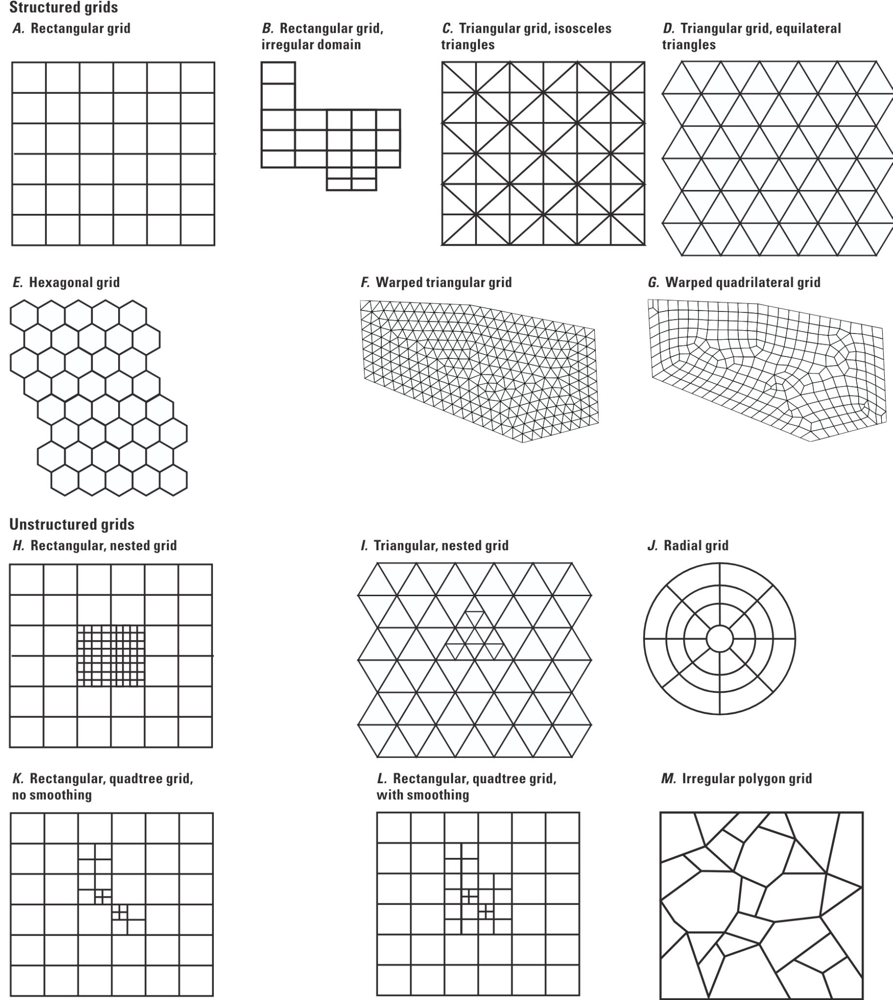

## Today {.smaller}

::: {.kicker}
Week 6, session 1 of 2
:::

1. Quiz: five minutes, on regression
2. What changes when you build a model
3. The conceptual model that comes before the grid
4. The equation MODFLOW solves, and how it discretizes it
5. MODFLOW packages and their roles
6. Writing input files with FloPy

So far, you have used observations to study aquifer behavior. This week you
begin building groundwater flow models based on conservation of mass.

# Why a model {background-color="#0C234B"}

## What observations cannot tell you

::: {.incremental}
- A hydrograph tells you the water table fell
- It does not tell you **where the water went**
- A trend line describes how an observation changed through time
- It does not tell you **how much** moves along it
:::

::: {.fragment .due-notice}
A groundwater flow model estimates the flows and storage changes that make up
a **water budget**.
:::

## The question a model answers

> *Of the 20,000 m³/d this wellfield produces, how much is recharge, how much is
> water taken out of storage, and how much is flow captured from the river?*

::: {.fragment}
These contributions are difficult to measure separately across an entire
aquifer.
:::

::: {.fragment}
A model estimates each contribution while requiring inflows, outflows, and
storage changes to balance.
:::

## Model assumptions

::: {.incremental}
- Some parameters must be estimated from limited data
- Boundary conditions represent assumptions about the surrounding system
- A model can run successfully with incorrect assumptions
- Check results against observations and expected behavior
:::

::: {.fragment}
In Weeks 6 to 10, you will build models and evaluate whether their results are
consistent with the system you are studying.
:::

<!-- Figure recovered from old_slides/hwrs564a_oct23.pdf, p. 7. -->
## The modeling cycle {.smaller}

::: {.columns}
::: {.column width="60%"}
{fig-alt="A modeling cycle linking conceptualization, data collection, simulation and calibration, and hypothesis testing" width="85%"}
:::

::: {.column width="40%"}
Use the first simulation to evaluate your assumptions.

::: {.incremental}
- Compare its behavior with observations
- Identify assumptions that need revision
- Revise the conceptual model
- Test again
:::

::: {.fragment .due-notice}
Repeated comparisons with observations help assess whether a model is useful
for its intended purpose.
:::
:::
:::

<!-- Adapted from old_slides/hwrs564a_oct23.pdf. -->
## Define the conceptual model

Before opening FloPy, write down four things:

::: {.incremental}
1. **Purpose**: what decision or flux must the model inform?
2. **System and boundaries**: what is inside, and what crosses the edges?
3. **Inputs and outputs**: what is imposed, and what will be compared to data?
4. **Use test**: what result would change your conclusion?
:::

::: {.fragment .due-notice}
Choose the grid, packages, and solver to address the model question and
represent the conceptual model.
:::

# The equation {background-color="#0C234B"}

## Groundwater flow, in one line

$$\frac{\partial}{\partial x}\left(K_x \frac{\partial h}{\partial x}\right) +
\frac{\partial}{\partial y}\left(K_y \frac{\partial h}{\partial y}\right) +
\frac{\partial}{\partial z}\left(K_z \frac{\partial h}{\partial z}\right)
+ W = S_s \frac{\partial h}{\partial t}$$

::: {.fragment}
This equation combines Darcy's law with conservation of mass.
:::

::: {.fragment}
- left: flow in and out through the faces of a control volume
- $W$: sources and sinks, including wells, recharge, and ET
- right: change in storage
:::

## Discretizing it

MODFLOW replaces the derivatives with differences between **cells**.

::: {.incremental}
- Split the aquifer into a grid of boxes
- Write the balance for each box: inflow − outflow = change in storage
- One equation per cell, one unknown head per cell
- Solve the resulting linear system
:::

::: {.fragment}
A 40 × 60 grid has 2,400 equations per layer. Regional models can have millions
of equations, requiring numerical solvers such as those introduced in Week 4.
:::

<!-- Figure recovered from old_slides/hwrs564a_oct23.pdf, p. 11. -->
## The grid can match the question {.smaller}

::: {.columns}
::: {.column width="67%"}
{fig-alt="Examples of rectangular, triangular, hexagonal, nested, radial, and irregular polygon numerical grids" width="72%"}
:::

::: {.column width="33%"}
Each grid divides the domain into cells where the flow equations are solved.

::: {.fragment}
We begin with a rectangular structured grid because it makes indexing,
neighbors, and cell dimensions visible.
:::
:::
:::

## Your turn: how many unknowns?

A regional model has 3 layers, 500 rows, 800 columns, and runs 240 monthly stress
periods.

```{pyodide}
#| setup: true
#| exercise: ex_size
nlay, nrow, ncol = 3, 500, 800
nper = 240
```

```{pyodide}
#| exercise: ex_size
cells = ______
equations_per_solve = cells
total_solves = ______
print(f"{cells:,} cells")
print(f"{cells * nper:,} head values in the output")
```

::: {.hint exercise="ex_size"}
::: {.callout-note collapse="false"}
## Hint

One unknown head per cell per time. The number of cells is the product of the
three grid dimensions.
:::
:::

::: {.solution exercise="ex_size"}
::: {.callout-tip collapse="false"}
## Solution

```python
cells = nlay * nrow * ncol
total_solves = nper
```

1.2 million cells, and 288 million head values written to disk over the run. At
8 bytes each that is 2.3 GB of output from a single model.

Choose which time steps to save based on the results you need and the storage
available.
:::
:::

# MODFLOW packages {background-color="#AB0520"}

<!-- Package tree rebuilt from old_slides/hwrs564a_oct23.pdf, p. 9, using the
     MODFLOW-2005 packages introduced in this course. -->
## The name file connects a family of packages {.smaller}

```{mermaid}
%%| fig-width: 10
%%| fig-height: 4.4
flowchart LR
  NAM[".nam<br/>name file"]
  NAM --> GS["Geometry and state<br/>DIS · BAS"]
  NAM --> PH["Aquifer physics<br/>LPF"]
  NAM --> ST["Stresses and boundaries<br/>WEL · RCH · EVT · RIV"]
  NAM --> SO["Solver<br/>PCG"]
  NAM --> OU["Output control<br/>OC"]

  classDef hub fill:#0C234B,color:#fff,stroke:#0C234B;
  classDef pkg fill:#E2E9EB,color:#1a1a1a,stroke:#1E5288;
  class NAM hub;
  class GS,PH,ST,SO,OU pkg;
```

::: {.fragment}
The `.nam` file lists the input packages used in a simulation. Each package
defines a part of the model, such as the grid, aquifer properties, or wells.
:::

<small>Structure adapted to MODFLOW-2005 from the modular framework documented by the USGS.</small>

## What an input file looks like

```
# DIS package for MODFLOW-2005, generated by Flopy.
         1        10        20         1         4         2
         0
       100.0
       100.0
       100.0
     1.0         1         1.000000      TR
```

::: {.fragment}
MODFLOW reads values in a prescribed order. Check the package documentation
to identify each field.
:::

::: {.fragment .due-notice}
Use **FloPy to generate input files**. When troubleshooting a model, inspect
the generated files to check what MODFLOW received.
:::

## FloPy writes them for you

```python
import flopy

mf = flopy.modflow.Modflow("basin", model_ws=ws, exe_name=mf2005)

flopy.modflow.ModflowDis(mf, nlay=1, nrow=10, ncol=20,
                         delr=100.0, delc=100.0,
                         top=100.0, botm=0.0,
                         nper=1, steady=True)
mf.write_input()
```

::: {.fragment}
FloPy provides named arguments and defaults for MODFLOW inputs. It also checks
some inputs and reports errors in Python.
:::

## Your turn: calculate the bottom elevation

`top` and `botm` are **elevations above datum**. An aquifer whose top is at 600 m
and which is 200 m thick has what `botm`?

```{pyodide}
#| setup: true
#| exercise: ex_botm
top = 600.0
thickness = 200.0
```

```{pyodide}
#| exercise: ex_botm
botm = ______
print(f"top {top} m, botm {botm} m, thickness {top - botm} m")
```

::: {.hint exercise="ex_botm"}
::: {.callout-note collapse="false"}
## Hint

If `botm` were 200 the layer would be 400 m thick. Elevations decrease downward.
:::
:::

::: {.solution exercise="ex_botm"}
::: {.callout-tip collapse="false"}
## Solution

```python
botm = top - thickness
```

`400.0`. Setting `botm=200.0` would give a layer 400 m thick. Check the
difference between `top` and `botm` when defining each layer.
:::
:::

## Wrap up {.smaller}

::: {.kicker}
What you should have learned
:::

- A groundwater flow model estimates flows and storage changes in a water budget
- Define the purpose, system, boundaries, and use test before building the grid
- MODFLOW discretizes the flow equation into one equation per cell
- MODFLOW uses separate packages, listed in the `.nam` file
- `top` and `botm` are elevations
- Check that the MODFLOW executable is available

::: {.kicker}
Next up:
:::

Running your first MODFLOW model
