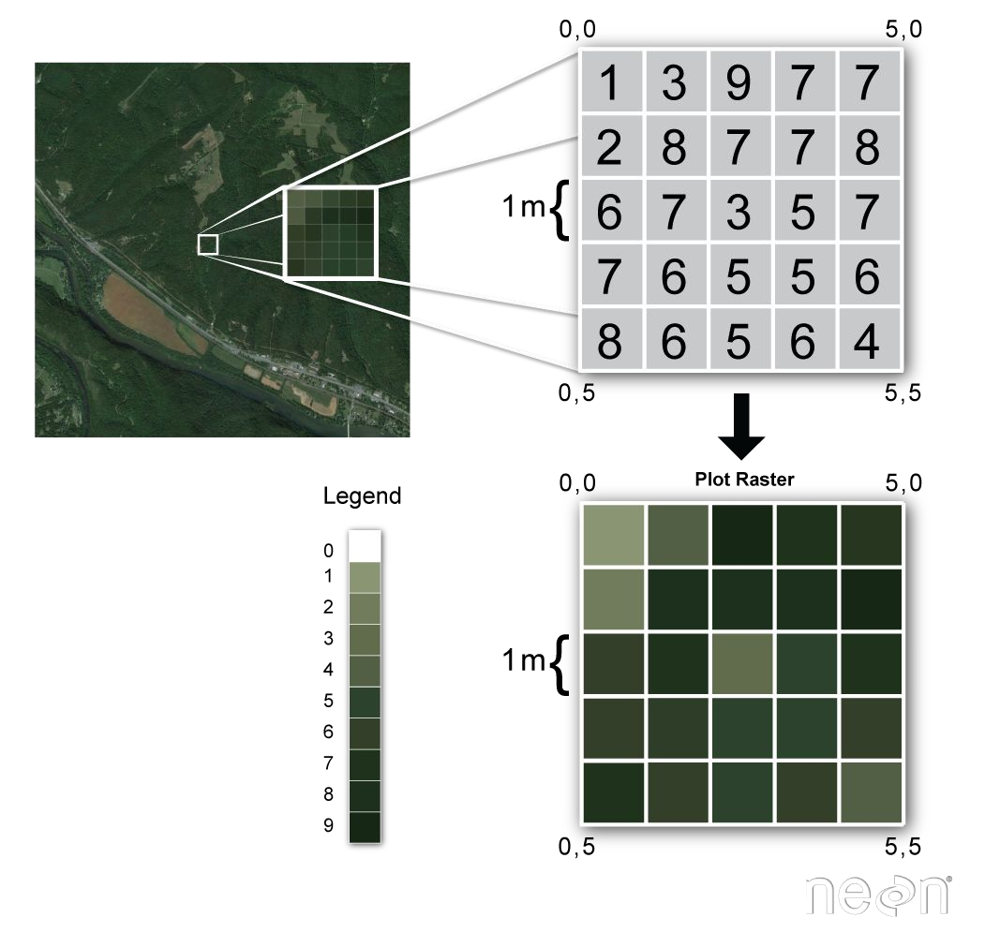
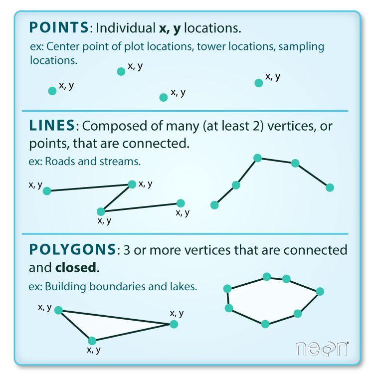
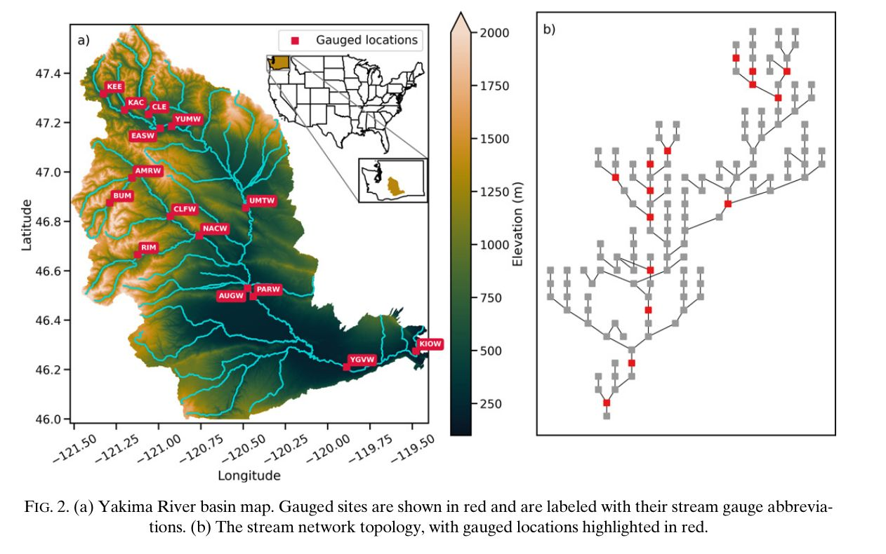

## Today {.smaller}

::: {.kicker}
Week 8, session 2 of 2
:::

1. Annotation: spending the reader's attention deliberately
2. Titles that say something
3. Maps from latitude and longitude, without lying about shape
4. Two meanings of vector vs. raster, then `figsize` and `dpi`
5. The panel that keeps a figure honest

# Annotation {background-color="#0C234B"}

## A reader looks for a few seconds

Annotation is how you spend those seconds on the thing you care about, rather
than leaving the reader to search for it.

::: {.incremental}
- **`ax.axhline` / `axvline`** — a reference value
- **`ax.axvspan`** — a period that means something
- **`ax.annotate`** — an arrow to one point
- **`ax.text`** — a label anywhere
:::

## All four at once

```python
ax.axhline(baseline, color="grey", ls=":")
ax.text(x0, baseline - 4, "level when records began", color="grey")

ax.axvspan(pd.Timestamp("1950-01-01"), pd.Timestamp("1980-01-01"),
           color="#81D3EB", alpha=0.18)
ax.text(pd.Timestamp("1952-01-01"), 30, "peak agricultural pumping")

ax.annotate(f"{deepest:.0f} ft", xy=(date, deepest),
            xytext=(-70, 26), textcoords="offset points",
            arrowprops=dict(arrowstyle="->"))
```

::: {.fragment}
`textcoords="offset points"` positions the label **relative to the point**, in
typographic points. That way it stays put when the axis limits change.
:::

## Titles are the most wasted line

::: {.columns}
::: {.column width="50%"}
**Wasted**

> Depth to water vs. time

Names the axes. The reader can already see the axes.
:::

::: {.column width="50%"}
**Useful**

> Well D-15-13 11CBA: 110 ft of decline over 63 years of record

States the finding.
:::
:::

::: {.fragment .due-notice}
If your title could be generated automatically from the axis labels, it is doing
no work. **Say what the figure shows.**
:::

## Your turn: mark the monsoon

```{pyodide}
#| setup: true
#| exercise: ex_annot
import matplotlib.pyplot as plt
clim = [32.0, 31.1, 17.8, 5.1, 0.6, 0.3, 18.5, 23.4, 7.9, 3.0, 1.8, 9.8]
months = list(range(1, 13))
```

```{pyodide}
#| exercise: ex_annot
fig, ax = plt.subplots(figsize=(8, 3.2))
ax.bar(months, clim, color="#1E5288", alpha=0.85)
ax.axvspan(5.5, 9.5, color="#81D3EB", alpha=0.25)
ax.text(7.5, 28, ______, ha="center", color="#1E5288")
ax.set_title(______)
ax.set_ylabel("mean daily discharge (cfs)")
plt.show()
```

::: {.hint exercise="ex_annot"}
::: {.callout-note collapse="false"}
## Hint

The label is one word. The title should state what the two peaks and the gap
between them *mean* — not "discharge by month".
:::
:::

::: {.solution exercise="ex_annot"}
::: {.callout-tip collapse="false"}
## Solution

```python
ax.text(7.5, 28, "monsoon", ha="center", color="#1E5288")
ax.set_title("Sabino Creek peaks twice a year, with a dry foresummer between")
```

Two peaks with different causes: January is winter frontal storms, July–August
is monsoon convection. A title saying "monthly discharge" leaves the reader to
notice that themselves, and most won't.
:::
:::

# Maps {background-color="#AB0520"}

<!-- Adapted from old_slides/hwrs564a_oct14.pdf. -->
## Raster and vector describe two different decisions {.smaller}

| Context | Raster | Vector |
|---|---|---|
| **GIS data** | A grid of cells: elevation, temperature, recharge | Points, lines, and polygons: wells, rivers, basin boundaries |
| **Saved figures** | Pixels: PNG or JPEG | Drawing instructions: PDF or SVG |

::: {.fragment}
A vector basin boundary can be plotted over a raster elevation grid, then the
whole figure can be saved as either a raster PNG or a vector PDF.
:::

::: {.fragment .due-notice}
Same words, different decisions: **data structure** when building the map,
**output format** when exporting the figure.
:::

<!-- Figures recovered from old_slides/hwrs564a_oct14.pdf, p. 51. -->
## Raster stores values; vector stores geometry {.smaller}

::: {.columns}
::: {.column width="52%"}
**Raster: one value per cell**

{fig-alt="A landscape image enlarged into a grid of numeric raster cells and then colored by cell value" width="76%"}
:::

::: {.column width="48%"}
**Vector: coordinates make features**

{fig-alt="Vector points, connected lines, and closed polygons represented by x and y coordinates" width="76%"}
:::
:::

<small>Legacy source graphics reproduced from the course's prior GIS introduction.</small>

## A map is a scatter with two obligations

::: {.incremental}
1. The **aspect ratio** has to be right
2. The reader has to be able to tell **where they are**
:::

::: {.fragment}
At 32°N a degree of longitude is only $\cos(32°) \approx 0.85$ as long as a
degree of latitude. Plotting them 1:1 stretches the basin east–west by 18%.
:::

```python
ax.set_aspect(1 / np.cos(np.deg2rad(lat.mean())))
```

<!-- Figure recovered from old_slides/hwrs564a_oct14.pdf, p. 46. -->
## A map and a network answer different questions {.smaller}

::: {.columns}
::: {.column width="68%"}
{fig-alt="Yakima River basin elevation map and its corresponding stream-network topology, with gauged locations highlighted in red" width="98%"}
:::

::: {.column width="32%"}
**The map preserves**

- location and elevation
- basin shape
- spatial context

**The network preserves**

- upstream/downstream order
- junctions and connectivity
- gauged versus ungauged reaches
:::
:::

<small>Bennett et al. (2022), *Journal of Hydrometeorology*, Fig. 2.</small>

## Your turn: fix the aspect

```{pyodide}
#| setup: true
#| exercise: ex_aspect
import matplotlib.pyplot as plt, numpy as np
rng = np.random.default_rng(8)
lat = 32.0 + rng.random(300) * 0.45
lon = -111.2 + rng.random(300) * 0.45
```

```{pyodide}
#| exercise: ex_aspect
fig, ax = plt.subplots(figsize=(5, 5))
ax.scatter(lon, lat, s=6, color="#AB0520", alpha=0.6)
ax.set_aspect(______)
ax.set_xlabel("longitude")
ax.set_ylabel("latitude")
plt.show()
```

::: {.hint exercise="ex_aspect"}
::: {.callout-note collapse="false"}
## Hint

`np.deg2rad` converts degrees to radians, which is what `np.cos` expects. The
aspect you want is one divided by that cosine.
:::
:::

::: {.solution exercise="ex_aspect"}
::: {.callout-tip collapse="false"}
## Solution

```python
ax.set_aspect(1 / np.cos(np.deg2rad(lat.mean())))
```

About 1.18. For a small area that correction is honest and sufficient.

For anything larger — or when you need a projection, a scale bar, or a
basemap — use `cartopy`. Two warnings from the lab: **`plt.tight_layout()`
crashes on a cartopy axis**, and **coastlines and basemaps download shapefiles**,
which fails in a fresh codespace with no network.
:::
:::

# Saving {background-color="#0C234B"}

## Four arguments that matter

```python
fig, ax = plt.subplots(figsize=(6.5, 4))     # INCHES
fig.savefig("fig.png", dpi=300, bbox_inches="tight")
fig.savefig("fig.pdf", bbox_inches="tight")
```

::: {.incremental}
- **`figsize`** in inches — sets how big the text is *relative to* the data
- **`dpi=300`** for raster; 72 looks fine on screen and terrible on paper
- **`bbox_inches="tight"`** crops whitespace, stops a long label being cut off
- **`.pdf` / `.svg`** for papers — vector, sharp at any zoom, usually smaller
:::

## Why `figsize` is not "how big"

::: {.fragment}
Set `figsize=(12, 8)`, save it, then scale it to 3 inches wide in Word.
**Every font scales down with it** and the axis labels become unreadable.
:::

::: {.fragment}
Set `figsize` to the **final printed width** — a single journal column is about
3.5 inches, a full page about 7 — and the 10-point font you specified is 10
points on the page.
:::

::: {.fragment .due-notice}
The most common reason a figure looks amateurish is that it was made at the
wrong size and resized afterwards.
:::

## The panel that keeps you honest

::: {.columns}
::: {.column width="55%"}
Median depth across all wells looks like a clean basin-wide signal.

Underneath it, the **number of wells measured each year**.
:::

::: {.column width="45%"}
2007 → 2008: median jumps 71 → 242 ft.

The aquifer did not drop 170 feet. The well count went 3 → 5, and the three were
shallow.
:::
:::

::: {.fragment}
**That entire feature is a sampling artifact**, and it is invisible without the
bottom panel.
:::

## Your turn: what does this figure need?

```{pyodide}
#| setup: true
#| exercise: ex_honest
claims = {
    "a": "a smoothed trend line through the median",
    "b": "a second panel showing how many wells were measured each year",
    "c": "error bars from the standard deviation across wells",
    "d": "a larger font size",
}
```

```{pyodide}
#| exercise: ex_honest
needed = ______
print(claims[needed])
```

::: {.hint exercise="ex_honest"}
::: {.callout-note collapse="false"}
## Hint

The problem is not that the median is imprecise. The problem is that it is
computed over a *different set of wells* every year.
:::
:::

::: {.solution exercise="ex_honest"}
::: {.callout-tip collapse="false"}
## Solution

```python
needed = "b"
```

Error bars would describe the spread *among the wells measured*, which does not
help — the issue is which wells those are. A trend line would smooth the
artifact into something even more convincing.

Only the sample size exposes it. **Put `n` next to any aggregate computed over
a changing population**, and let the reader discount the years where it collapses.
:::
:::

## Wrap up {.smaller}

::: {.kicker}
What you did today
:::

- Annotate the thing you want looked at; don't leave the reader to search
- A title that could be generated from the axis labels is doing no work
- Correct the aspect on any lat/lon map
- Distinguish GIS raster/vector data from raster/vector output formats
- `figsize` in final printed inches, `dpi=300`, `bbox_inches="tight"`
- Show the sample size when the sample changes

::: {.kicker}
What's due
:::

- **HW 6 — Timeseries aggregation**, Wednesday 10/14 at 11:59pm
- **Project 2 analysis, part 1**

::: {.kicker}
Next week
:::

Regression — deriving the least-squares line, then spending a full class
diagnosing and interpreting it.
